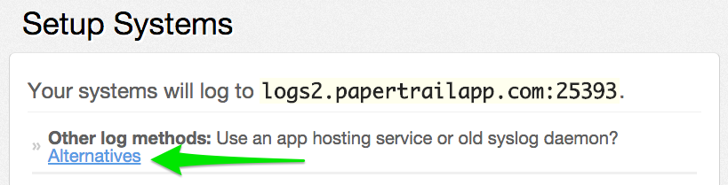
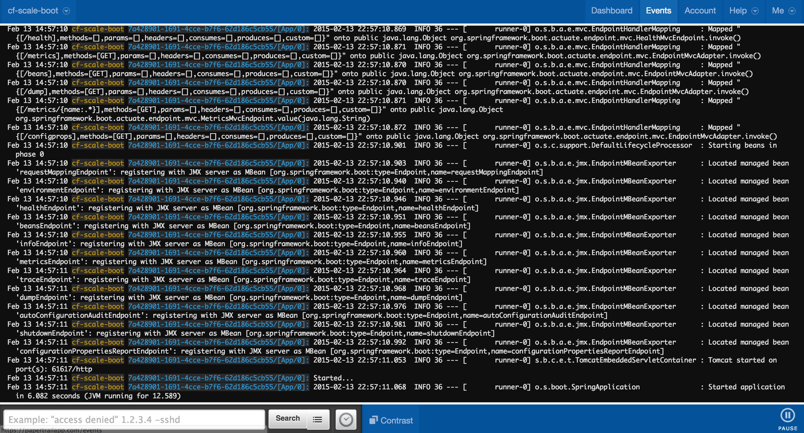
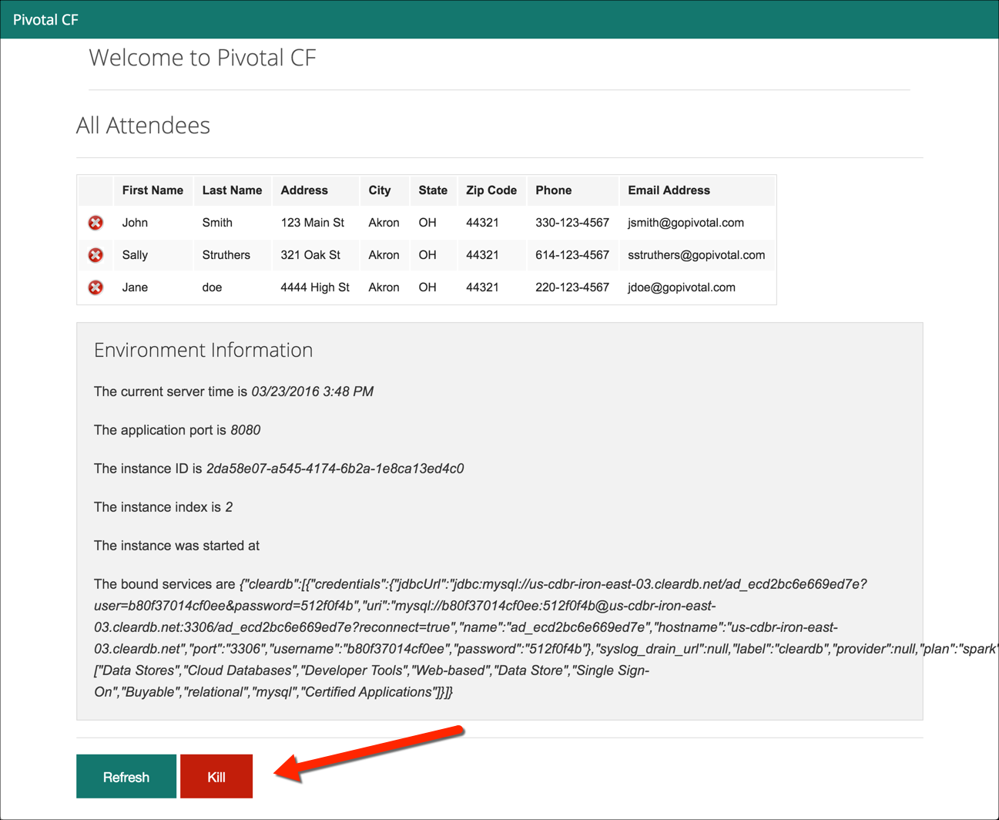
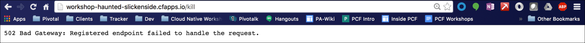
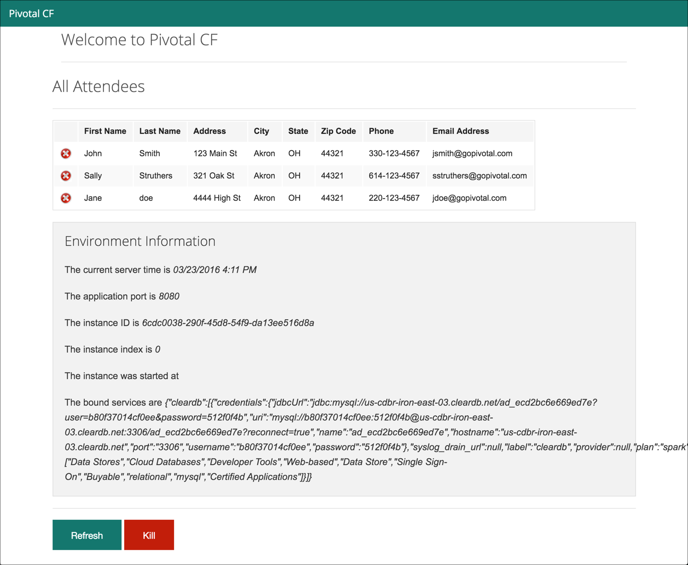

= Lab 4 - Monitoring your Application

[abstract]
--
Pivotal Cloud Foundry (PCF) makes the work of performing operations actions, such as scaling, zero-downtime deploys, and managing application health very easy. In the this lab, you will continue to explore PCF application operations.
--

== Tailing Application Logs

One of the most important enablers of visibility into application behavior is logging.  Effective management of logs has historically been very difficult. Cloud Foundry's https://github.com/cloudfoundry/loggregator[log aggregation] components simplify log management by assuming responsibility for aggregating logs.  Application developers need only log all messages to either `STDOUT` or `STDERR`, and the platform will capture these messages.

=== For Developers

Application developers can view application logs using the CF CLI.

. Let's view recent log messages for the application.  For this lab, use the Java sample workshop app.
+
----
$ cf logs workshop --recent
----
+
Here are two interesting subsets of one output from that command:
+
.CF Component Logs
====
----
2016-03-22T09:27:28.37-0500 [APP/0]      OUT 2016-03-22 14:27:28.373  INFO 14 --- [       Thread-2] j.LocalContainerEntityManagerFactoryBean : Closing JPA EntityManagerFactory for persistence unit 'default'
2016-03-22T09:27:30.76-0500 [RTR/4]      OUT workshop-haunted-slickenside.cfapps.io - [22/03/2016:14:27:28 +0000] "GET /kill HTTP/1.1" 502 0 67 "http://workshop-haunted-slickenside.cfapps.io/" "Mozilla/5.0 (Macintosh; Intel Mac OS X 10_11_3) AppleWebKit/537.36 (KHTML, like Gecko) Chrome/49.0.2623.87 Safari/537.36" 10.10.66.45:28136 x_forwarded_for:"96.35.38.180" x_forwarded_proto:"http" <1> vcap_request_id:45cf0503-5988-446e-5fdc-ff9b04f4eb04 response_time:2.569998304 app_id:108c3e83-88ff-43af-a5b6-b356d346e0b8
2016-03-22T09:27:30.78-0500 [APP/0]      OUT Exit status 255 <2>
2016-03-22T09:27:30.78-0500 [CELL/0]     OUT Exit status 0
2016-03-22T09:27:30.84-0500 [API/2]      OUT App instance exited with guid 108c3e83-88ff-43af-a5b6-b356d346e0b8 payload: {"instance"=>"537e99cc-b891-42d2-6d0c-885f80296926", "index"=>0, "reason"=>"CRASHED", "exit_description"=>"2 error(s) occurred:\n\n* 2 error(s) occurred:\n\n* Exited with status 255\n* cancelled\n* cancelled", "crash_count"=>1, "crash_timestamp"=>1458656850797105183, "version"=>"d34837f0-cb42-498f-adf2-cc506df42a98"}
2016-03-22T09:27:31.04-0500 [CELL/0]     OUT Creating container <3>
----
<1> An ``Apache-style'' access log event from the (Go)Router
<2> An API log event that corresponds to an event as shown in `cf events`
<3> A CELL log event indicating the creation of an application container on CELL 0.
====
+
.Application Logs
====
----
2016-03-22T09:28:08.85-0500 [APP/1]      OUT 2016-03-22 14:28:08.853  INFO 14 --- [           main] nfigurationApplicationContextInitializer : Adding cloud service auto-reconfiguration to ApplicationContext
2016-03-22T09:28:08.87-0500 [APP/1]      OUT 2016-03-22 14:28:08.876  INFO 14 --- [           main] io.pivotal.workshop.WorkshopApplication  : Starting WorkshopApplication on f8edin7an5l with PID 14 (/home/vcap/app started by vcap in /home/vcap/app)
2016-03-22T09:28:08.89-0500 [APP/2]      OUT 2016-03-22 14:28:08.897  INFO 16 --- [           main] s.b.c.e.t.TomcatEmbeddedServletContainer : Tomcat initialized with port(s): 8080 (http)
2016-03-22T09:28:09.00-0500 [APP/1]      OUT 2016-03-22 14:28:09.008  INFO 14 --- [           main] s.c.a.AnnotationConfigApplicationContext : Refreshing org.springframework.context.annotation.AnnotationConfigApplicationContext@839d6d: startup date [Tue Mar 22 14:28:09 UTC 2016]; root of context hierarchy
2016-03-22T09:28:09.15-0500 [APP/2]      OUT 2016-03-22 14:28:09.156  INFO 16 --- [           main] o.apache.catalina.core.StandardService   : Starting service Tomcat
2016-03-22T09:28:09.15-0500 [APP/2]      OUT 2016-03-22 14:28:09.157  INFO 16 --- [           main] org.apache.catalina.core.StandardEngine  : Starting Servlet Engine: Apache Tomcat/8.0.26
----
====
+
.SSH activity
====
----
2016-03-22T08:35:24.27-0500 [SSH/0]      OUT Successful remote access by 10.10.2.195:19968
2016-03-22T08:49:30.31-0500 [SSH/0]      OUT Successful remote access by 10.10.66.204:25788
----
====
As you can see, Cloud Foundry's log aggregation components capture both application logs and CF component logs relevant to your application.
These events are properly interleaved based on time, giving you an accurate picture of events as they transpired across the system.

. To get a running _tail_ of the application logs rather than a dump, simply type:
+
----
$ cf logs workshop
----
+
You can try various things like refreshing the browser and triggering stop/start events to see logs being generated. Press `Ctrl-C` to exit the `cf logs workshop` tailing of the logs.

=== For Operators (OPTIONAL)

Application operators will also enjoy commands like `cf logs`, but are often interested in long-term retention, indexing, and analysis of logs as well. Cloud Foundry currently only provides short-term retention of logs. To meet these needs, Cloud Foundry provides the ability to https://docs.pivotal.io/pivotalcf/devguide/services/log-management.html[drain logs to third-party providers.]

In this section, you will drain logs to a very simple provider called https://papertrailapp.com[Papertrail].

. Visit https://papertrailapp.com and create a free account.

. Login to your account and _Add your first system_:
+
image::papertrail_1.png[]

. Click on _Alternatives_:
+

. Choose _I use Heroku_ and provide a name like "cloud-workshop-logs":
+
image::papertrail_3.png[]

. Note the URL + Port assigned to your application:
+
image::papertrail_4.png[]

. We'll use a Cloud Foundry http://docs.pivotal.io/pivotalcf/devguide/services/user-provided.html[user-provided service instance] to create the log drain for our application using the URL + Port provided by Papertrail:
+
----
$ cf cups workshop-logs -l syslog://logs2.papertrailapp.com:43882
Creating user provided service workshop-logs in org instructor-org / space development as instructor...
OK
----

. We bind that service instance into our application
+
----
$ cf bind-service workshop workshop-logs
Binding service workshop-logs to app workshop in org instructor-org / space development as instructor...
OK
TIP: Use 'cf restage workshop' to ensure your env variable changes take effect
----

. We'll use a `cf restart` rather than `cf restage` to make the binding take effect:
+
----
$ cf restart workshop
----

. Navigate to the home Dashboard of the Papertrail app and select your 'system' to see log events immediately flowing to the log viewing page:
+

You can see how to connect to other third-party log management systems in the https://docs.pivotal.io/pivotalcf/devguide/services/log-management-thirdparty-svc.html[Cloud Foundry documentation].

== Health Management

Cloud Foundry's http://docs.cloudfoundry.org/concepts/architecture/#hm9k[Heatlh Manager] actively monitors the health of our application processes and will restart them should they crash.

. If you don't have one already running, start a log tail for `workshop`.  Alternatively, you could view the logs using the papertrail app.
+
----
$ cf logs workshop
----

. If you do not have more than one application instance running, execute the scale command to scale to 2 or more application instances.  Visit the application in the browser, and click on the _Kill_ button. This button will trigger a JVM exit with an error code (`System.exit(1)`), causing the Health Manager to observe an application instance crash:
+

. After clicking the kill switch a couple of interesting things should happen.
First, you'll see an error code returned in the browser, as the request you submitted never returns a response:
+

+
Also, if you're paying attention to the log tail, you'll see some interesting log messages fly by:
+
====
----
2016-03-23T15:50:05.000+00:00 [APP] OUT 2016-03-23 15:50:05.186 WARN 14 --- [nio-8080-exec-4] i.p.w.w.CloudFoundryWorkshopController : *** The system is shutting down. *** <1>
2016-03-23T15:51:39.000+00:00 [RTR] OUT workshop-haunted-slickenside.cfapps.io - [23/03/2016:15:51:38 +0000] "GET / HTTP/1.1" 200 0 5579 "-" "Mozilla/5.0 (Macintosh; Intel Mac OS X 10_11_3) AppleWebKit/537.36 (KHTML, like Gecko) Chrome/49.0.2623.87 Safari/537.36" 10.10.2.247:49485 x_forwarded_for:"96.35.38.180" x_forwarded_proto:"http" vcap_request_id:eb21d1c7-e20e-403d-6010-06c0cf84c6d3 response_time:0.556708687 app_id:108c3e83-88ff-43af-a5b6-b356d346e0b8
2016-03-23T15:55:32.000+00:00 [APP] OUT 2016-03-23 15:55:32.659 INFO 14 --- [ main] s.c.a.AnnotationConfigApplicationContext : Refreshing org.springframework.context.annotation.AnnotationConfigApplicationContext@5b6142d8: startup date [Wed Mar 23 15:55:32 UTC 2016]; root of context hierarchy
2016-03-23T15:55:33.000+00:00 [APP] OUT 2016-03-23 15:55:33.164 INFO 14 --- [ main] trationDelegate$BeanPostProcessorChecker : Bean 'encryptionBootstrapConfiguration' of type [class org.springframework.cloud.bootstrap.encrypt.EncryptionBootstrapConfiguration$$EnhancerBySpringCGLIB$$ef27ea2b] is not eligible for getting processed by all BeanPostProcessors (for example: not eligible for auto-proxying)
2016-03-23T15:55:33.000+00:00 [APP] OUT 2016-03-23 15:55:33.778 WARN 14 --- [ main] .i.s.PathMatchingResourcePatternResolver : Skipping [/home/vcap/app/.java-buildpack/spring_auto_reconfiguration/spring_auto_reconfiguration-1.10.0_RELEASE.jar] because it does not denote a directory
...
2016-03-23T15:55:26.000+00:00 [RTR] OUT workshop-haunted-slickenside.cfapps.io - [23/03/2016:15:55:24 +0000] "GET /kill HTTP/1.1" 502 0 67 "http://workshop-haunted-slickenside.cfapps.io/" "Mozilla/5.0 (Macintosh; Intel Mac OS X 10_11_3) AppleWebKit/537.36 (KHTML, like Gecko) Chrome/49.0.2623.87 Safari/537.36" 10.10.2.247:60563 x_forwarded_for:"96.35.38.180" x_forwarded_proto:"http" vcap_request_id:8059d1b6-3411-432b-4a4a-1c9dad7cba04 response_time:2.334086126 app_id:108c3e83-88ff-43af-a5b6-b356d346e0b8
2016-03-23T15:50:05.000+00:00 [APP] OUT 2016-03-23 15:50:05.435 INFO 14 --- [ Thread-2] o.s.c.support.DefaultLifecycleProcessor : Stopping beans in phase 0 <2>
2016-03-23T15:48:06.000+00:00 [RTR] OUT workshop-haunted-slickenside.cfapps.io - [23/03/2016:15:48:06 +0000] "GET / HTTP/1.1" 200 0 5579 "-" "Mozilla/5.0 (Macintosh; Intel Mac OS X 10_11_3) AppleWebKit/537.36 (KHTML, like Gecko) Chrome/49.0.2623.87 Safari/537.36" 10.10.2.247:9755 x_forwarded_for:"96.35.38.180" x_forwarded_proto:"http" vcap_request_id:ad88d9d3-f5d2-4b74-67ba-cd084ac1c7bc response_time:0.501049717 app_id:108c3e83-88ff-43af-a5b6-b356d346e0b8
2016-03-23T15:50:08.000+00:00 [CELL] OUT Exit status 0
2016-03-23T15:55:33.000+00:00 [APP] OUT =========|_|==============|___/=/_/_/_/
2016-03-23T15:55:36.000+00:00 [APP] OUT 2016-03-23 15:55:36.031 INFO 14 --- [ main] edisCloudServiceBeanFactoryPostProcessor : Skipping auto-reconfiguring beans of type org.springframework.data.redis.connection.RedisConnectionFactory
2016-03-23T15:55:37.000+00:00 [APP] OUT 2016-03-23 15:55:37.469 INFO 14 --- [ost-startStop-1] o.a.c.c.C.[Tomcat].[localhost].[/] : Initializing Spring embedded WebApplicationContext
2016-03-23T15:55:38.000+00:00 [APP] OUT 2016-03-23 15:55:38.760 INFO 14 --- [ost-startStop-1] o.s.b.c.embedded.FilterRegistrationBean : Mapping filter: 'applicationContextIdFilter' to: [/*]
2016-03-23T15:50:08.000+00:00 [API] OUT App instance exited with guid 108c3e83-88ff-43af-a5b6-b356d346e0b8 payload: {"instance"=>"dc7e216e-e776-4bec-7155-98c8f1650298", "index"=>1, "reason"=>"CRASHED", "exit_description"=>"2 error(s) occurred:\n\n* 2 error(s) occurred:\n\n* Exited with status 255\n* cancelled\n* cancelled", "crash_count"=>1, "crash_timestamp"=>1458748208680686728, "version"=>"d34837f0-cb42-498f-adf2-cc506df42a98"}  <3>
----
<1> Just before issuing the `System.exit(1)` call, the application logs that the kill switch was clicked.
<2> The Router logs the 502 error.
<3> The API logs that an application instance exited due to a crash.
====

. Wait a few seconds...  By this time you should have noticed some additional interesting events in the logs:
+
====
----
2016-03-23T15:55:37.000+00:00 [APP] OUT 2016-03-23 15:55:37.288 INFO 14 --- [ main] o.apache.catalina.core.StandardService : Starting service Tomcat <1>
2016-03-23T15:55:37.000+00:00 [APP] OUT 2016-03-23 15:55:37.290 INFO 14 --- [ main] org.apache.catalina.core.StandardEngine : Starting Servlet Engine: Apache Tomcat/8.0.26
2016-03-23T15:55:39.000+00:00 [APP] OUT 2016-03-23 15:55:39.616 INFO 14 --- [ main] org.hibernate.cfg.Environment : HHH000021: Bytecode provider name : javassist
2016-03-23T15:55:40.000+00:00 [APP] OUT 2016-03-23 15:55:40.259 INFO 14 --- [ main] o.hibernate.annotations.common.Version : HCANN000001: Hibernate Commons Annotations {4.0.5.Final}
2016-03-23T15:55:40.000+00:00 [APP] OUT 2016-03-23 15:55:40.811 INFO 14 --- [ main] org.hibernate.tool.hbm2ddl.SchemaUpdate : HHH000232: Schema update complete
----
<1> The new application instance starts logging events as it starts up.
====

. Revisiting the *HOME PAGE* of the application (don't simply refresh the browser as you're still on the `/kill` endpoint and you'll just kill the application again!) and you should see a fresh instance started:
+

== Viewing Application _Events_

Cloud Foundry only allows application configuration to be modified via its API.
This gives application operators confidence that all changes to application configuration are known and auditable.
It also reduces the number of causes that must be considered when problems arise.

All application configuration changes are recorded as _events_.
These events can be viewed via the Cloud Foundry API, and viewing is facilitated via the CLI.

Take a look at the events that have transpired so far for our deployment of `workshop`:

====
----
$ cf events workshop
Getting events for app workshop in org instructor-org / space development as instructor...

time                          event                 actor      description
2015-08-11T08:58:57.00-0400   app.crash             workshop   index: 0, reason: CRASHED, exit_description: app instance exited, exit_status: 255  <6>
2015-08-11T08:58:17.00-0400   audit.app.update      admin      instances: 5 <5>
2015-08-11T08:58:11.00-0400   audit.app.update      admin
2015-08-11T08:58:11.00-0400   audit.app.map-route   admin
2015-08-11T08:54:35.00-0400   audit.app.update      admin      state: STARTED  <4>
2015-08-11T08:54:22.00-0400   audit.app.update      admin  <3>
2015-08-11T08:54:22.00-0400   audit.app.map-route   admin  <2>
2015-08-11T08:54:19.00-0400   audit.app.create      admin      instances: 1, memory: 512, state: STOPPED, environment_json: PRIVATE DATA HIDDEN <1>
----
<1> Events are sorted newest to oldest, so we'll start from the bottom.
Here we see the `app.create` event, which created our application's record and stored all of its metadata (e.g. `memory: 512`).
<2> The `app.map-route` event records the incoming request to assign a route to our application.
<3> This `app.update` event records the resulting change to our applications metadata.
<4> This `app.update` event records the change of our application's state to `STARTED`.
<5> Remember scaling the application up? This `app.update` event records the metadata change `instances: 5`.
<6> And here's the `app.crash` event recording that we encountered a crash of an application instance.
====

. Let's explicitly ask for the application to be stopped:
+
----
$ cf stop workshop
Stopping app workshop in org instructor-org / space development as instructor...
OK
----

. Now, examine the additional `app.update` event:
+
----
$ cf events workshop
Getting events for app workshop in org instructor-org / space development as instructor...

time                          event                 actor           description
2015-08-11T09:01:35.00-0400   audit.app.update      instructor      state: STOPPED
2015-08-11T08:58:57.00-0400   app.crash             workshop        index: 0, reason: CRASHED, exit_description: app instance exited, exit_status: 255
2015-08-11T08:58:17.00-0400   audit.app.update      instructor      instances: 5
2015-08-11T08:58:11.00-0400   audit.app.update      instructor
2015-08-11T08:58:11.00-0400   audit.app.map-route   instructor
2015-08-11T08:54:35.00-0400   audit.app.update      instructor      state: STARTED
2015-08-11T08:54:22.00-0400   audit.app.update      instructor
2015-08-11T08:54:22.00-0400   audit.app.map-route   instructor
2015-08-11T08:54:19.00-0400   audit.app.create      instructor      instances: 1, memory: 512, state: STOPPED, environment_json: PRIVATE DATA HIDDEN
----

. Start the application again:
+
----
$ cf start workshop
Starting app workshop in org instructor-org / space development as instructor...

0 of 3 instances running, 3 starting
0 of 3 instances running, 3 starting
0 of 3 instances running, 3 starting
2 of 3 instances running, 1 starting

App started

OK

App workshop was started using this command `CALCULATED_MEMORY=$($PWD/.java-buildpack/open_jdk_jre/bin/java-buildpack-memory-calculator-2.0.1_RELEASE -memorySizes=metaspace:64m.. -memoryWeights=heap:75,metaspace:10,native:10,stack:5 -memoryInitials=heap:100%,metaspace:100% -totMemory=$MEMORY_LIMIT) && JAVA_OPTS="-Djava.io.tmpdir=$TMPDIR -XX:OnOutOfMemoryError=$PWD/.java-buildpack/open_jdk_jre/bin/killjava.sh $CALCULATED_MEMORY -Djava.security.egd=file:///dev/urandom" && SERVER_PORT=$PORT eval exec $PWD/.java-buildpack/open_jdk_jre/bin/java $JAVA_OPTS -cp $PWD/.:$PWD/.java-buildpack/spring_auto_reconfiguration/spring_auto_reconfiguration-1.10.0_RELEASE.jar org.springframework.boot.loader.JarLauncher`

Showing health and status for app workshop in org instructor-org / space development as instructor...
OK

requested state: started
instances: 3/3
usage: 512M x 3 instances
urls: workshop-haunted-slickenside.cfapps.io
last uploaded: Mon Mar 21 21:38:44 UTC 2016
stack: unknown
buildpack: java-buildpack=v3.6-https://github.com/cloudfoundry/java-buildpack.git#5194155 java-main java-opts open-jdk-like-jre=1.8.0_73 open-jdk-like-memory-calculator=2.0.1_RELEASE spring-auto-reconfiguration=1.10.0_RELEASE

     state      since                    cpu    memory           disk           details
#0   starting   2016-03-23 11:21:06 AM   0.0%   374.9M of 512M   153.4M of 1G
#1   running    2016-03-23 11:21:24 AM   0.1%   358.8M of 512M   153.4M of 1G
#2   running    2016-03-23 11:21:23 AM   0.0%   696K of 512M     1.3M of 1G
----

. And again, view the additional `app.update` event:
+
----
$ cf events workshop
Getting events for app workshop in org instructor-org / space development as instructor...

time                          event                      actor               description
2016-03-23T11:21:06.00-0500   audit.app.update           instructor          state: STARTED
2016-03-23T11:20:57.00-0500   audit.app.update           instructor          state: STOPPED
----

link:/README.adoc#hands-on-labs-materials[Course Materials home]
